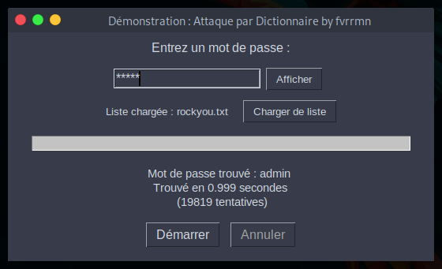

# outils-sensibilisation-personnel
*Démonstration d’outils afin de sensibiliser le personnel aux risques et aux potentielles Cyberattaques en entreprise.*

 
  
  
  
<em>Image protégée – Propriété exclusive</em>

---

**Avertissement - Usage pédagogique uniquement**

Les scripts présents dans ce dépôt sont uniquement éducatifs.  
 
L’auteur décline toute responsabilité pour tout usage non autorisé.

*Voir le fichier LICENSE pour les détails.*

## Introduction

Dans un contexte où les cyberattaques se multiplient, il est crucial que le personnel d’une entreprise prenne conscience des risques encourus. Cette section propose une série d’outils et de démonstrations pratiques destinés à sensibiliser les collaborateurs aux différentes menaces numériques, à renforcer leur vigilance et à promouvoir des comportements sécurisés au quotidien.

## Sommaire

1. [Attaque par BruteForce](#1-bruteforce)  
2. [Attaque par Dictionnaire](#2-attaque_dictionnaire)

## Attaque par BruteForce

Une attaque par BruteForce consiste à essayer automatiquement toutes les combinaisons possibles Jusqu'à trouver la bonne combinaison.

Deux facteurs rendent la tâche plus difficile :
- Longueur du mot de passe (12 caractères minimum)
- Diversité des caractères utilisés (Minuscules, Majuscules, Chiffres, Symboles) 

Exemples :
- 8 chiffres : `77777777` → 10⁸ = 100 000 000 combinaisons, cela se parcourt en 20s
- 8 caractères mélangés : `pa$$w0rd` → 69⁸ = 513 798 374 428 641 combinaisons, cela se parcourt en 3,26 années

*Ces valeurs sont des approximations. Elles changent selon les hypothèses (Taille du Charset...), la vitesse d’essais (Online/Offline, GPU...) et les protections (Hash lent, Verrouillage, 2FA)*

  
  

*Cela revient au même que d'essayer d'ouvrir une porte avec une serrure et un trousseau contenant toutes les clés possibles.*

## Attaque par Dictionnaire

Une attaque par Dictionnaire parcourt une liste prédéfinie de mots (WordList) : Mots courants, Variantes, Mots composés, Dates, Substitutions (@ pour A, 0 pour O...). Puis, essaye automatiquement chaque mot Jusqu'à trouver le bon mot de passe.

⚠️ L'attaquant peut créer une liste personnalisée en fonction de sa cible.

Il faut éviter :
- Utiliser des informations personnelles (Prénom, Nom, Date de naissance, Animal...)
- Semer des indices sur les réseaux sociaux (Code postal, Date de mariage, Prénoms des enfants, Modèle de voiture... )
- Combinaison : `Flavien33000`

  
  

